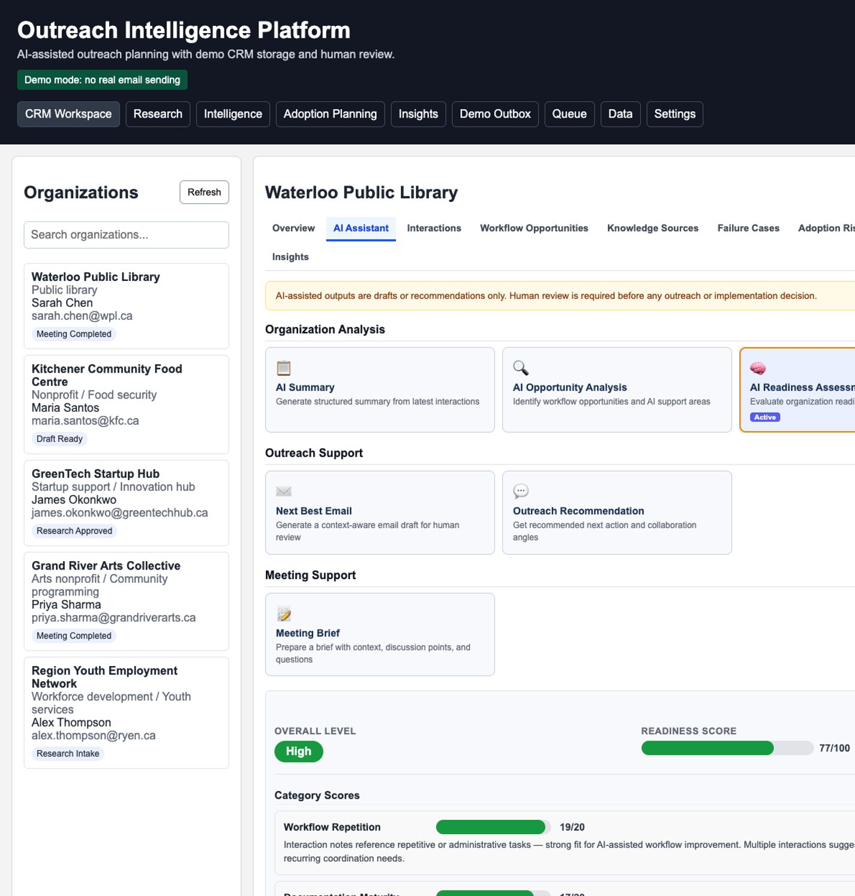
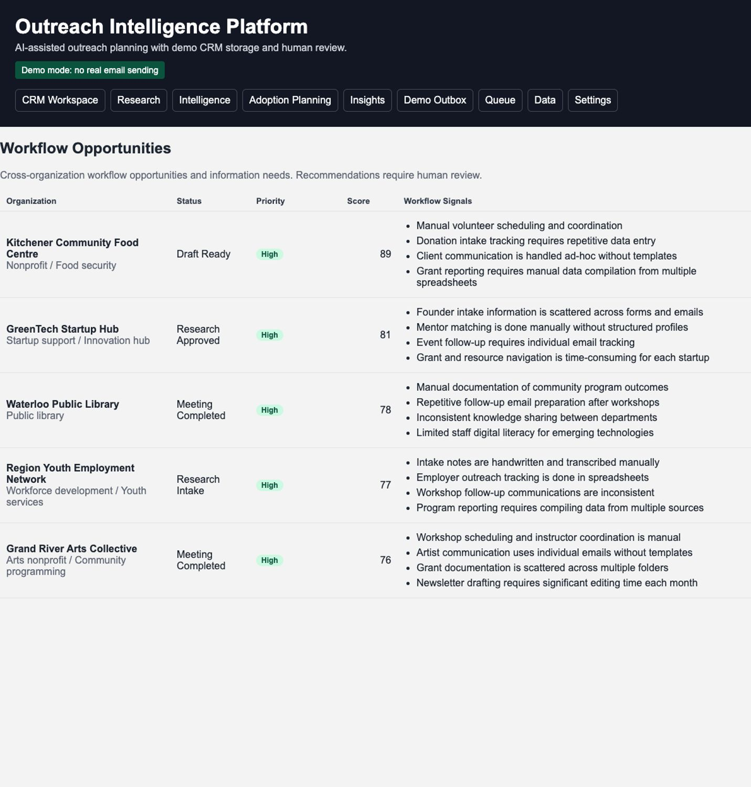
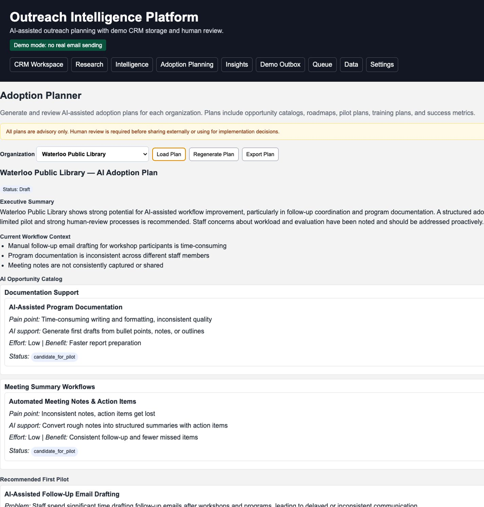
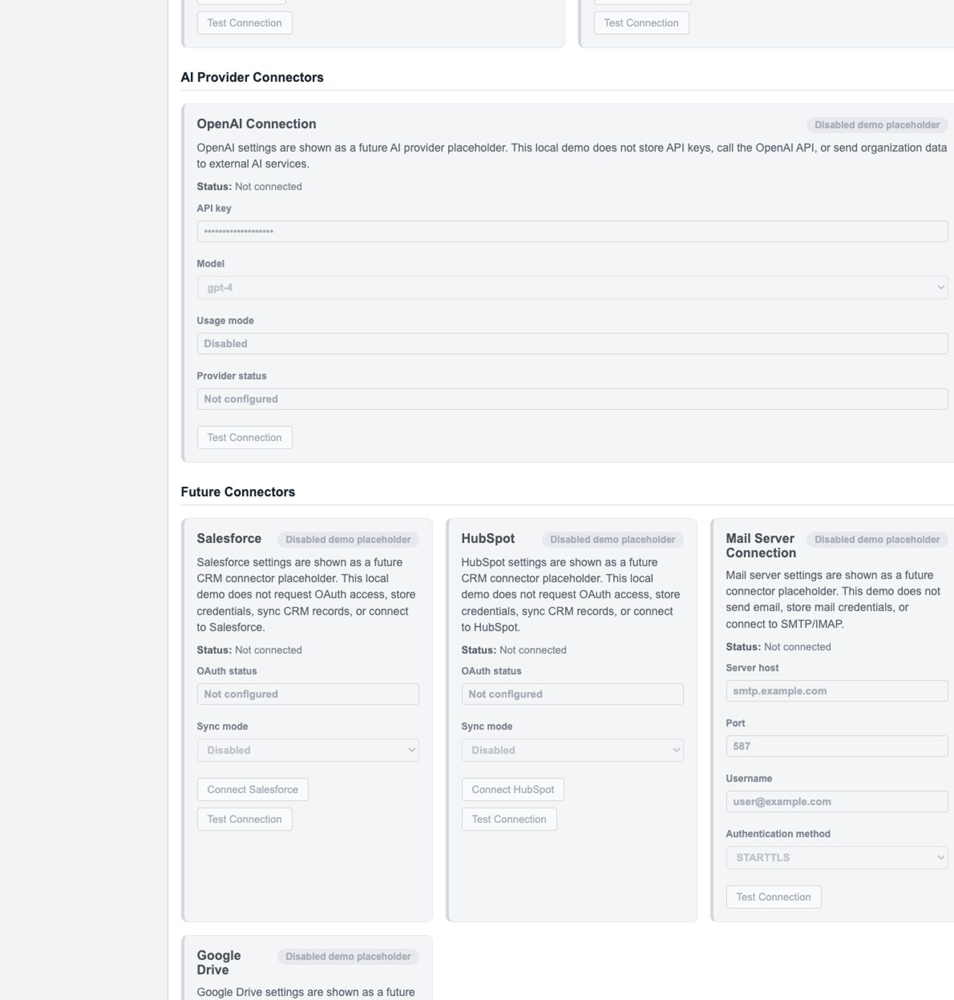

# Outreach Intelligence Platform

A portfolio demo for **AI-assisted outreach and workflow intelligence**. The platform turns organization profiles and interaction notes into structured knowledge about practical AI adoption opportunities, required knowledge sources, failure cases, human-review needs, and human-system adoption risks.

This project is intentionally safe: **it does not send real emails**. AI-assisted drafts are saved to a local **Demo Outbox** for human review and manual sending outside the app.

## Product Thesis

Successful AI adoption is not only a technical problem. Organizations also need to understand workflow pain points, knowledge sources, human-review requirements, failure cases, staff concerns, evaluation ambiguity, recognition gaps, and training needs.

The platform therefore treats **adoption risk as part of workflow intelligence**, not as a final afterthought. When interaction notes are entered, the system does not only look for possible AI-use opportunities. It also captures human-system risks that could affect whether an opportunity is realistic, trusted, and sustainable.

The core product idea is:

```text
Organization profile + interaction notes
  → AI-assisted note summary
  → workflow opportunities
  → knowledge sources
  → failure cases / exceptions
  → human-system and adoption-risk notes
  → workflow insights for future adoption planning
```

## Screenshots

### CRM Workspace


### AI Assistant



### Workflow Opportunities



### AI Adoption Planner



### Settings Placeholders



## Method Notes

This project was informed by summarized learning notes on practical AI adoption, workflow transformation, human review, failure cases, AI talent development, and organizational change.

See [`docs/method-notes.md`](docs/method-notes.md) for the supporting method notes used to shape the seed adoption principles.

## What This Is

This is not meant to replace a CRM. It is an **AI intelligence layer** that can sit above different data sources.

Current data source:

- Local JSON demo CRM

Future data sources:

- Salesforce
- HubSpot
- Microsoft Dynamics
- Zoho CRM
- CSV import/export

## What Makes This Project Different

Many AI demos focus on prompt writing, generic productivity, or automated outreach. This project focuses on the earlier discovery stage of practical AI adoption:

- What workflow pain points are visible from real interactions?
- Which repeated tasks may be suitable for AI assistance?
- What knowledge sources would AI need before it could help safely?
- Where is human judgment still required?
- What could fail, and what exceptions need to be captured?
- Are there staff concerns around workload, trust, evaluation, or recognition?
- Which opportunities are low-risk enough to validate before broader planning?

The project is designed to show **human-reviewed AI adoption discovery**, not autonomous outreach or full automation.

## Current Feature Areas

### 1. CRM Workspace

The CRM Workspace provides the local organization directory and relationship context.

- Organization directory
- Contact name, general contact email, phone number, and website
- Outreach status
- Last interaction notes
- Editable contact fields
- Local JSON data storage
- Connector-agnostic service layer

### 2. Interaction Notes and AI Summaries

Interactions are the main source of workflow intelligence.

- Record interactions per organization: Meeting, Call, Email, Research Note, Follow-up, or Other
- Store date, title, notes, outcome, next action, follow-up date, and tags
- Run **AI Note Summary** on an interaction to extract structured knowledge
- Extract summary, discussion points, decisions, action items, risks, recommended follow-up, tags, and suggested follow-up tasks
- Use mock AI by default, with optional local LLM mode — no external API calls are required by default

### Knowledge Extraction Process

Interactions are the raw input for workflow intelligence. When a user records an interaction and runs AI Note Summary, the app extracts structured information from the note and stores it in local JSON-backed records.

```text
Interaction note
  → AI Note Summary
  → structured extraction fields
  → local JSON-backed knowledge records
  → organization-level workflow intelligence
  → search, analytics, and adoption planning inputs
```

The extraction produces the following kinds of knowledge, where supported:

* summary and key discussion points
* action items and follow-up tasks
* workflow pain points
* repeated manual tasks
* possible AI-use opportunities
* knowledge sources required for AI support
* failure cases and exceptions
* human-review requirements
* staff concerns
* evaluation or recognition risks
* training or follow-up needs
* adoption safeguards
* reusable insights and playbook candidates

Extracted records accumulate at the organization level. Repeated similar findings strengthen evidence rather than creating duplicates. Source evidence is preserved where practical through source interaction IDs, note summary IDs, evidence excerpts, evidence count, and last-seen timestamps.

The following records are created or updated when AI Note Summary is run:

* [Interaction summary](#2-interaction-notes-and-ai-summaries) — saved to `interaction_summaries.json`
* Follow-up tasks — returned as suggestions for user review and manual creation
* [Workflow opportunities](#3-workflow-opportunities) — auto-saved with deduplication and evidence tracking
* [Knowledge sources](#4-knowledge-sources) — auto-saved per organization
* [Failure cases](#5-failure-cases-and-exceptions) — auto-saved with deduplication and evidence tracking
* [Adoption risk notes](#6-human-system-and-adoption-risks) — auto-saved with source interaction references
* Lessons learned, reusable insights, and playbook candidates — included in the summary response and viewable per interaction

### 2a. AI Assistant Tab

Each organization detail view includes a dedicated **AI Assistant** tab containing all AI-powered action cards, grouped into:

- **Organization Analysis** — AI Summary, AI Opportunity Analysis, AI Readiness Assessment
- **Outreach Support** — Next Best Email, Outreach Recommendation
- **Meeting Support** — Meeting Brief

A safety note at the top of the tab reads: *"AI-assisted outputs are drafts or recommendations only. Human review is required before any outreach or implementation decision."*

### 3. Workflow Opportunities

Workflow Opportunities capture possible AI-use cases discovered from interaction notes.

Each opportunity may include:

- Current process
- Pain point
- Possible AI support
- Repetitive task pattern
- Human review requirement
- Required knowledge sources
- Known failure cases
- Staff impact
- Adoption risk level
- Next discovery questions
- Source interaction or note summary
- Status: `Identified`, `Needs Validation`, `Candidate for Pilot`, or `Not Suitable`

Workflow opportunities should behave as **organization-level accumulated knowledge**. If similar opportunities appear across multiple interactions, they should be merged or treated as stronger evidence rather than displayed as duplicates.

### 4. Knowledge Sources

Knowledge Sources record where required information lives.

Examples:

- FAQ documents
- Past meeting notes
- Past emails or drafts
- Policies
- Templates
- Q&A records
- Training materials
- Reports
- Public website content
- Staff expertise

Knowledge sources are metadata only. The app does not access external files or cloud storage.

### 5. Failure Cases and Exceptions

Failure cases capture what could go wrong before an AI-supported workflow is proposed too confidently.

Each failure case may include:

- What failed or may fail
- Why it failed
- Missing context
- Human review requirement
- Suggested prevention step
- Related workflow opportunity
- Source interaction

This supports the project’s human-in-the-loop design: failure cases define where review, safeguards, or more knowledge are required.

### 6. Human System and Adoption Risks

Human-system risks are part of the core product model.

Each organization can have **Adoption Risk Notes** that capture risks such as:

- Workload increase risk
- Staff trust concerns
- Unclear evaluation criteria
- Lack of recognition for AI-enabled efficiency
- Role confusion
- Training gaps
- Knowledge-sharing gaps
- Quality or privacy concerns
- Missing adoption safeguards

Each risk note may include risk type, description, severity, related staff role, suggested mitigation, source interaction, and tags.

This section reflects the idea that AI adoption can fail if people, incentives, workflows, and leadership practices are not ready.

The project also reflects my interest in fair recognition of employees who use AI responsibly to improve their work, instead of treating AI-enabled efficiency as a reason to simply increase workload.

The project also treats AI adaptation discussions as part of adoption readiness. When AI improves efficiency, organizations may need explicit meetings to review how that change affects workload, evaluation, recognition, role clarity, and knowledge sharing.


### 7. Workflow Insights

Workflow Insights aggregate the structured knowledge created from interactions.

Tracked patterns may include:

- Total searchable knowledge items
- Organizations with or without interaction history
- Workflow opportunities identified
- Opportunities requiring human review
- Organizations missing knowledge source notes
- Failure cases recorded
- Candidate pilot workflows
- Adoption risk notes recorded
- Staff concern notes
- Evaluation or recognition risk notes
- High-severity adoption risks

The UI should use product-facing labels such as **Workflow Insights** or **Workflow Intelligence** rather than user-facing “Phase 3” wording.

### 8. Knowledge Search

Route: `/knowledge-search`

Knowledge Search indexes local data including:

- Organizations
- Interactions
- Follow-up tasks
- Demo Outbox drafts
- Lessons learned
- Reusable insights
- Playbook candidates
- Workflow opportunities
- Knowledge sources
- Failure cases
- Human-system and adoption-risk notes

Search supports keyword search, organization filtering, and content-type filtering.

### 9. Demo Outbox

The Demo Outbox is a separate human-review queue for AI-assisted outreach drafts.

- Saves generated email drafts locally
- Does not send emails
- Does not use SMTP, Gmail, Outlook, or OAuth
- Allows review before a human manually sends outside the app
- Keeps draft review separate from CRM relationship tracking

Preferred product model:

```text
CRM Workspace = organization and relationship context
Demo Outbox = human-reviewed draft queue
```

### 10. Adoption Principles / Method Knowledge

The project can store reusable AI adoption principles seeded from initial method knowledge. These principles guide how future interaction notes are interpreted into workflow opportunities, knowledge sources, failure cases, human-system risks, and future planning inputs.

Initial principles include:

- AI adoption should start with small, repeatable workflow-efficiency wins before larger revenue or automation projects.
- AI training should focus on changing real workflows, not only teaching tool usage.
- Effective AI adoption should develop people who can identify inefficient workflows themselves, break those workflows into steps, test small AI-assisted improvements, and share the results as reusable organizational knowledge.
- Effective AI workflows require structured, searchable, reliable knowledge sources.
- Failure cases and exceptions should be documented because they define where human review is needed.
- Experienced staff should guide AI workflow design because they can judge output quality.
- AI should support experienced workers by helping turn their knowledge into repeatable workflows.
- Workflows should be decomposed into smaller steps before deciding whether each step belongs to generative AI, browser automation, OCR, search, templates, or human judgment.
- Human review should remain explicit for externally visible, quality-sensitive, private, or judgment-heavy work.

### AI Talent and Workflow Learning

The seed method knowledge also reflects the idea that effective AI adoption depends on people who understand their work well enough to identify inefficient workflows, test small improvements, and share what they learn.

Rather than treating AI training as only tool usage or prompt instruction, the project frames AI adoption as a workflow-learning cycle:

```text
identify a small inefficient workflow
  → test an AI-assisted or automated improvement
  → review the result
  → share the example internally
  → store the example as reusable knowledge
  → use the accumulated examples to find the next improvement
```

Many AI training efforts may fail to produce measurable workflow impact when they focus only on tool usage rather than helping staff identify, test, and improve real business processes.

This reinforces the project’s focus on experienced staff, fast iteration, internal knowledge sharing, human review, and incentives that recognize productivity improvements rather than simply increasing workload.

## Demo Workflow

1. **Research Intake** → fill in organization details → save to CRM
2. **Organization Discovery** → enter a research theme → review mock candidates → approve one → it joins the CRM
3. Open **CRM Workspace** → select an organization → review summary, readiness, outreach recommendation, and interaction history
4. Add an **Interaction** with meeting or research notes
5. Run **AI Note Summary** → extract follow-up tasks and workflow intelligence
6. Review generated **Workflow Opportunities**, **Knowledge Sources**, **Failure Cases**, and **Human System / Adoption Risk Notes**
7. Use **Knowledge Search** to find relevant lessons, risks, sources, or opportunities across organizations
8. Use **Workflow Insights** to review patterns across the local dataset
9. Generate **Next Best Email** → review and edit the draft → save to **Demo Outbox**
10. Export data via CSV or JSON at the Data Tools page

## Safety Boundaries

- **No real email sending.** Drafts are saved locally to `backend/app/data/outbox.json`. No SMTP, Gmail API, or Outlook API is configured or called.
- **No SMS or phone automation.** Phone numbers are stored as informational strings only. No Twilio, no calling, no texting.
- **No web scraping.** Research Intake requires manual entry. Organization Discovery uses local mock data only.
- **No external API calls by default.** All AI responses use the configured provider (mock or local LLM via llama.cpp). No OpenAI, no external CRM APIs, no cloud services by default. See [AI Provider Configuration](#ai-provider-configuration) for switching modes.
- **No OAuth.** No OAuth flows are configured for any connector.
- **All connector settings are disabled demo placeholders.** Salesforce, HubSpot, Microsoft Dynamics 365, Gmail, Outlook, Google Drive, Dropbox, SharePoint/OneDrive, OpenText, Mail Server, and OpenAI — none request OAuth access, store credentials, sync records/files, make API calls, or connect to any external service.
- **Human review required before any action.** All recommendations, assessments, tasks, and drafts are informational. No auto-creation or auto-sending of any kind.
- **Attachments are stored locally only.** Uploaded files stay in `backend/data/attachments/`. No file is sent or shared externally.
- **Knowledge sources are metadata only.** No external files or cloud repositories are accessed.

## Frontend Pages

```text
/                         CRM workspace with organization list, organization detail, AI actions,
                          interaction history, knowledge summary, meeting notes, and follow-up tasks
/research-intake          Manual research intake form for saving reviewed organizations to the Local CRM
/organization-discovery   Mock candidate discovery workflow with Approve, Edit, and Reject review actions
/knowledge-search         Search across organizations, interactions, tasks, drafts, workflow opportunities,
                          knowledge sources, failure cases, and adoption risk notes
/demo-outbox              Separate local draft review queue; no sending
/integrations             Settings page: local demo config, connector stubs (labeled "Settings" in nav)
/data-tools               CSV import with preview-then-confirm flow, CSV export, and JSON export
/analytics                Workflow Insights and analytics: overview metrics, outreach pipeline,
                          readiness summary, follow-up workload, draft activity, and workflow intelligence
/priority-queue           All organizations ranked by outreach priority score with filtering
/follow-ups               Global follow-up task list with filters by status, priority, and organization
```

## Organization Detail Tabs

The organization detail view keeps organization-specific data separated into readable tabs:

```text
Overview
AI Assistant
Interactions
Workflow Opportunities
Knowledge Sources
Failure Cases
Human System
Insights
```

This reinforces the product flow: interactions are the raw source, while the other tabs show structured workflow-transformation knowledge derived from those interactions.

## Development Roadmap

The app currently includes features that correspond to three internal development stages. These stage labels are useful for the README and developer planning, but the app UI should use product-facing labels such as **Workflow Intelligence** and **Workflow Insights**.

### Foundation Features

- Local demo CRM
- Research Intake
- Organization Discovery
- Organization summaries
- AI Opportunity Analysis
- Context-aware email drafting
- Demo Outbox
- Meeting support
- Interaction history
- Organization Knowledge Summary
- AI Readiness Assessment
- CSV/JSON import and export
- Analytics dashboard

### Outreach Intelligence

- Outreach Recommendation
- Priority Queue
- Meeting Intelligence
- Suggested follow-up task generation
- Follow-up Tasks page
- Outreach Recommendation with task awareness
- Analytics with task statistics

### Workflow Transformation Knowledge

Interaction-derived knowledge is accumulated in local JSON files. When users add interactions and run AI Note Summary, the app stores structured workflow intelligence such as workflow opportunities, knowledge sources, failure cases, adoption risk notes, lessons learned, reusable insights, and playbook candidates in local JSON-backed data files.

Implemented features include:

- Organization Timeline
- Lessons Learned
- Reusable Insights
- Playbook Candidates
- Global Knowledge Search
- Enhanced Knowledge Summary
- Workflow Opportunity Records
- Knowledge Source Tracking
- Failure Case / Exception Tracking
- Human System / Adoption Risk Notes
- Workflow Insights analytics
- Adoption Principles / Method Knowledge
- Source-aware evidence tracking for interaction-derived records, including source interaction references, evidence counts, and excerpts where available

## Source-Aware Interaction-Derived Data

Workflow intelligence should be evidence-based. Records created from AI Note Summary should preserve source references where practical:

```text
source_interaction_id or source_interaction_ids
source_note_summary_id or source_note_summary_ids
evidence_excerpt or evidence_excerpts
evidence_count
last_seen_at
```

This allows the app to show why a workflow opportunity, knowledge source, failure case, or adoption risk exists.

## Duplicate Handling

Workflow opportunities, knowledge sources, failure cases, and adoption risk notes should avoid unnecessary duplicates.

For example, if three Waterloo Public Library interactions mention variants of “follow-up email drafting,” the app should show one accumulated opportunity with stronger evidence, not three duplicate cards.

Suggested deduplication fields:

```text
canonical_title
normalized_key
evidence_count
source_interaction_ids
source_note_summary_ids
evidence_excerpts
last_seen_at
```

Deduplication should be organization-specific, not global.

## Project Structure

```text
outreach_intelligence_platform/
├── .env.example              # Template — copy to .env, never commit .env
├── tools/
│   └── llm.py                # llama.cpp client, auto-starts server
├── backend/
│   ├── main.py               # FastAPI routes
│   ├── requirements.txt
│   ├── scripts/
│   │   └── seed_demo_data.py # Populates demo data
│   └── app/
│       ├── models.py
│       ├── connectors/
│       │   ├── base.py
│       │   ├── local_json.py
│       │   ├── salesforce_stub.py
│       │   └── hubspot_stub.py
│       ├── services/
│       │   ├── ai_mock.py
│       │   ├── ai_provider.py        # Provider abstraction & factory
│       │   ├── adoption_principles.py # Knowledge base service
│       │   ├── analytics.py
│       │   ├── attachments.py
│       │   ├── data_tools.py
│       │   ├── field_mapper.py
│       │   ├── interaction_summaries.py
│       │   ├── interactions.py
│       │   ├── knowledge.py
│       │   ├── outbox.py
│       │   ├── outreach_recommendation.py
│       │   ├── research_mock.py
│       │   ├── tasks.py
│       │   └── workflow.py           # Dedup-aware workflow intelligence
│       └── data/
│           ├── organizations.json
│           ├── interactions.json
│           ├── interaction_summaries.json
│           ├── workflow_knowledge.json
│           ├── outbox.json
│           ├── tasks.json
│           ├── adoption_principles.json         # Auto-seeded
│           ├── adoption_principles_seed.json    # Seed data
│           └── attachments/            # Local attachment storage
└── frontend/
    ├── index.html
    ├── styles.css
    └── app.js
```

## Clone and Run

```bash
git clone https://github.com/nmatsui7/outreach_intelligence_platform.git
cd outreach_intelligence_platform
python3.13 -m venv .venv
source .venv/bin/activate
pip install -r backend/requirements.txt
uvicorn backend.main:app --reload
```

Open:

```text
http://127.0.0.1:8000
```

The app runs in mock mode by default and does not require a local LLM, OpenAI API key, or external service.

## Running Without a Local LLM

The app does not require a local LLM to run. By default, AI-powered features use local mock AI logic and local demo data. This allows the portfolio demo to run without OpenAI API keys, Ollama, llama.cpp, LM Studio, or any external AI provider.

- **No OpenAI API key** is required.
- **No local LLM server** is required.
- **No Ollama / llama.cpp / LM Studio setup** is required.
- **No external AI service** is called.
- AI-powered buttons use local mock responses from the backend.
- Demo data can be seeded locally (see [Loading Demo Data](#loading-demo-data)).
- The Settings page shows disabled connector placeholders — they are not active.

### Troubleshooting

If AI-powered features appear empty, make sure demo data has been seeded or that the local JSON files under `backend/app/data/` are present.

Do not configure OpenAI, mail server, Google Drive, Salesforce, or HubSpot settings for the local demo. These are disabled placeholders.

## Setup

Notes:

- Python 3.13 is recommended for the current pinned dependencies. Python 3.14 may fail to install `pydantic-core` for these versions.
- The frontend is served by FastAPI from the `frontend/` directory, so no separate JavaScript package install or frontend dev server is required.
- Phone numbers are stored as optional contact information (simple string, no strict format enforcement) and are **not used for SMS, automated calling, or any outbound communication**.
- The platform uses a connector-agnostic service layer — AI features never depend on a specific CRM backend.
- Draft email attachments are saved locally in `backend/data/attachments/`. Supported file types: PDF, DOCX, TXT, PNG, JPG, CSV. Maximum file size: 5 MB.
- **Field mapping:** The MVP uses a lightweight local data model. Some internal field names differ from user-facing CSV/API labels and are mapped at import/export boundaries. See `backend/app/services/field_mapper.py` for the full mapping table. In short: `organization_type` (external) ↔ `category` (internal), and free-text fields (description, notes, program_area, etc.) are concatenated into `mission_notes` (internal). `program_area` is stored as a separate key on CSV import but embedded in `mission_notes` for Research Intake and Discovery — a known limitation of the lightweight model.
- **Timestamps:** `created_at` and `updated_at` are automatically set on organization creation and updates by `LocalJsonCRMConnector` (`backend/app/connectors/local_json.py`). Existing records missing these fields are handled gracefully — they appear as empty in exports. A `backfill_timestamps()` helper function is available to assign fallback values (marked `(backfilled)`) to legacy records.

## Loading Demo Data

The project includes a seed script that populates local JSON files with realistic mock demo data for testing.

```bash
python backend/scripts/seed_demo_data.py
```

### What the demo data includes

| Data | Count | Details |
|---|---|---|
| Organizations | 5 | Waterloo Public Library, Kitchener Community Food Centre, GreenTech Startup Hub, Grand River Arts Collective, Region Youth Employment Network |
| Interactions | 25 | 5 per organization, varying types (Meeting, Call, Email, Research Note, Follow-up) |
| AI Summaries | 25 | Pre-generated AI Note Summary results with extracted workflow intelligence |
| Workflow Opportunities | 17 | Pre-generated with dedup test (3 WPL interactions merged into 1, evidence_count=3) |
| Knowledge Sources | 16 | FAQ documents, past notes, templates, policies, spreadsheets across all orgs |
| Failure Cases | 8 | Generic tone, data errors, OCR accuracy, browser automation, privacy boundary issues |
| Adoption Risk Notes | 12 | Staff concerns, evaluation risks, privacy risks, knowledge gaps |
| Demo Outbox Drafts | 8 | Statuses: draft, needs_review, approved, sent_manually, archived |
| Follow-up Tasks | 15 | Mix of open, completed, overdue, high-priority tasks across all orgs |

### Demo scenarios covered

- **Full flow testing**: Organization profile → interactions → AI Note Summary → workflow opportunities → knowledge sources → failure cases → adoption risk notes → Demo Outbox → search and analytics
- **Human-system risk extraction**: Staff workload concerns, evaluation gaps, privacy concerns, knowledge-sharing gaps, voice/quality concerns
- **Workflow opportunity extraction**: Follow-up email drafting, volunteer scheduling, donation intake, founder intake, mentor matching, grant reporting, newsletter assembly, workshop follow-up, youth intake transcription
- **Knowledge source extraction**: FAQ documents, past notes, email templates, program calendars, policy documents, intake forms, Q&A records, grant reports, spreadsheets
- **Failure case extraction**: Generic tone risk, data errors, OCR inaccuracy, website automation fragility, overpromising services, public vs internal content boundaries
- **Duplicate handling test**: Waterloo Public Library interactions 1, 2, and 3 describe similar follow-up email pain points using different wording — the dedup system merges them into one opportunity with `evidence_count=3`

### Safety

- **Local mock data only.** No external systems are contacted.
- **No real customer data.** All organizations, interactions, and notes are fictional.
- **Contact emails use safe examples** (e.g., `sarah.chen@wpl.ca`, `info@example.org`).
- **Existing data is backed up** with a `.backup.json` suffix before overwriting.

## API Endpoints

```text
GET    /api/health
GET    /api/organizations
GET    /api/organizations/{id}
PATCH  /api/organizations/{id}/status
PATCH  /api/organizations/{id}  (update contact name, email, phone number, website)
GET    /api/organizations/{id}/summary
GET    /api/organizations/{id}/opportunities
POST   /api/organizations/{id}/readiness-assessment
GET    /api/organizations/{id}/outreach-recommendation  (internal roadmap: outreach intelligence)
GET    /api/organizations/{id}/knowledge-summary
GET    /api/organizations/{id}/meeting-brief
GET    /api/organizations/{id}/interactions
POST   /api/organizations/{id}/interactions
PATCH  /api/organizations/{id}/interactions/{interaction_id}
DELETE /api/organizations/{id}/interactions/{interaction_id}
POST   /api/organizations/{id}/interactions/{interaction_id}/summarize  (internal roadmap: outreach intelligence)
POST   /api/drafts/generate
POST   /api/outbox
GET    /api/outbox
POST   /api/outbox/{draft_id}/attachments
GET    /api/outbox/{draft_id}/attachments
DELETE /api/outbox/{draft_id}/attachments/{attachment_id}
POST   /api/meeting-notes/summarize
POST   /api/research/intake
POST   /api/research/discover
POST   /api/research/approve
POST   /api/data/import/csv
POST   /api/data/import/csv/confirm
GET    /api/data/export/csv
GET    /api/data/export/json
GET    /api/analytics/summary
GET    /api/analytics/priority-queue  (internal roadmap: outreach intelligence)
GET    /api/tasks  (internal roadmap: outreach intelligence)
POST   /api/tasks  (internal roadmap: outreach intelligence)
PATCH  /api/tasks/{task_id}  (internal roadmap: outreach intelligence)
DELETE /api/tasks/{task_id}  (internal roadmap: outreach intelligence)
GET    /api/organizations/{id}/workflow-opportunities  (internal roadmap: workflow transformation knowledge)
POST   /api/organizations/{id}/workflow-opportunities  (internal roadmap: workflow transformation knowledge)
PATCH  /api/organizations/{id}/workflow-opportunities/{opp_id}  (internal roadmap: workflow transformation knowledge)
GET    /api/organizations/{id}/knowledge-sources  (internal roadmap: workflow transformation knowledge)
POST   /api/organizations/{id}/knowledge-sources  (internal roadmap: workflow transformation knowledge)
PATCH  /api/organizations/{id}/knowledge-sources/{ks_id}  (internal roadmap: workflow transformation knowledge)
DELETE /api/organizations/{id}/knowledge-sources/{ks_id}  (internal roadmap: workflow transformation knowledge)
GET    /api/organizations/{id}/failure-cases  (internal roadmap: workflow transformation knowledge)
POST   /api/organizations/{id}/failure-cases  (internal roadmap: workflow transformation knowledge)
PATCH  /api/organizations/{id}/failure-cases/{fc_id}  (internal roadmap: workflow transformation knowledge)
GET    /api/organizations/{id}/adoption-risk-notes  (internal roadmap: workflow transformation knowledge)
POST   /api/organizations/{id}/adoption-risk-notes  (internal roadmap: workflow transformation knowledge)
PATCH  /api/organizations/{id}/adoption-risk-notes/{ar_id}  (internal roadmap: workflow transformation knowledge)
DELETE /api/organizations/{id}/adoption-risk-notes/{ar_id}  (internal roadmap: workflow transformation knowledge)
```

## Verification Checklist

After setup, these checks should pass:

```bash
python -m compileall backend tools
python -m pip check
node --check frontend/app.js
curl http://127.0.0.1:8000/api/health
curl http://127.0.0.1:8000/api/organizations
curl http://127.0.0.1:8000/api/analytics/summary
curl http://127.0.0.1:8000/api/tasks
```

All browser routes should return HTTP 200:

```text
/                     CRM Workspace
/organization-discovery
/research-intake
/knowledge-search
/demo-outbox
/analytics
/priority-queue
/follow-ups
/data-tools
/integrations          (labeled "Settings" in nav)
```

Note: In `AI_PROVIDER=local_llm` mode, `analytics/summary` and `priority-queue` make sequential LLM calls per organization and may be slow. The mock mode renders these instantly.


## AI Provider Configuration

All AI-assisted features route through a provider abstraction (`backend/app/services/ai_provider.py`), making the AI backend interchangeable without changing the rest of the codebase.

Set `AI_PROVIDER` in your `.env` file (project root):

```env
AI_PROVIDER=mock
```

### Provider Modes

| Mode | Value | Behavior | Requirements |
|---|---|---|---|
| **Mock (default)** | `mock` | Rule-based responses from `ai_mock.py`. Fast, deterministic, no external dependencies. | None |
| **Local LLM** | `local_llm` | Calls `tools/llm.py` → llama.cpp `llama-server` running on `localhost:8082`. Returns structured JSON from a real model. | llama-server binary, GGUF model file |
| **OpenAI (placeholder)** | `openai` | Falls back to mock. Ready for future implementation. | Not yet implemented |

AI-powered features can run in either mock mode or local LLM mode. Mock mode is the safest default for reviewers because it requires no model server, no API key, and no external service.

**Mock mode is the safest default.** It requires no model files, no running server, no network access, and no external dependencies. All AI features return realistic structured responses immediately.

### Architecture

```text
get_ai_provider()        ← factory, reads AI_PROVIDER env var
  ├── MockProvider       ← delegates to ai_mock.py (default, no dependencies)
  ├── LocalLlmProvider   ← calls tools/llm.py → llama.cpp server
  │     └── fallback     ← MockProvider on any error (logged)
  └── OpenAiProvider     ← placeholder, falls back to mock
```

Each provider implements the same method interface. If the LLM fails (timeout, invalid JSON, connection refused, etc.), the error is logged and a safe mock fallback is served — the app never crashes.

### Running With a Local LLM

The app can optionally use a local `llama-server` instance for AI-powered features. This is not required for the default demo; mock mode can run without any local model.

To use local LLM mode, start `llama-server` in one terminal:

```bash
llama-server \
  -m /path/to/your/model.gguf \
  --port 8082 \
  --ctx-size 8192 \
  --threads 6
```

Then start the app in another terminal:

```bash
cd outreach_intelligence_platform
source .venv/bin/activate
uvicorn backend.main:app --host 127.0.0.1 --port 8000
```

The AI provider is controlled by `.env`:

```text
AI_PROVIDER=local_llm
```

To run without a local LLM, use:

```text
AI_PROVIDER=mock
```

Mock mode uses local demo responses and does not require OpenAI, Ollama, LM Studio, llama.cpp, or any external AI provider.

### Local LLM Setup

1. Install [llama.cpp](https://github.com/ggerganov/llama.cpp) and build `llama-server`
2. Download a GGUF model (e.g., Gemma 4 4B IT Q8)
3. Create `.env` at the project root with these variables:

| Variable | Purpose | Example |
|---|---|---|
| `AI_PROVIDER` | Set to `local_llm` | `AI_PROVIDER=local_llm` |
| `MODEL_PATH` | Path to your GGUF model file | `MODEL_PATH=/path/to/your/model.gguf` |
| `LLAMA_PORT` | Port for llama-server (default `8082`) | `LLAMA_PORT=8082` |
| `LLAMA_CTX_SIZE` | Context window size in tokens | `LLAMA_CTX_SIZE=8192` |
| `LLAMA_THREADS` | CPU threads for inference | `LLAMA_THREADS=6` |
| `LLAMA_TIMEOUT` | HTTP timeout in seconds for LLM calls | `LLAMA_TIMEOUT=120` |

**Ports:** FastAPI serves on `:8000`, llama-server listens on `:8082`.

**Auto-start:** When `_is_server_running()` detects no server on `:8082`, `tools/llm.py` auto-starts llama-server with your configured `MODEL_PATH` and an optional `CHAT_TEMPLATE` (a Jinja chat template file you download for your model). The server stops on process exit.

**Keep machine-specific paths in `.env` only.** Never commit `.env`. Commit only `.env.example` with placeholder values.

### Behavior Summary

- `AI_PROVIDER=mock` (or unset) → fast, deterministic, no model required
- `AI_PROVIDER=local_llm` → real LLM inference via llama.cpp, with auto-start and fallback
- All modes return the same response shapes — the frontend never needs to know which provider is active
- The `derive_status_from_interactions` function is purely rule-based and uses mock logic regardless of provider


## Adoption Principles Knowledge Base

The app includes initial seed information that helps guide workflow intelligence extraction. These principles help frame how interaction notes are interpreted into workflow opportunities, knowledge sources, failure cases, human-system risks, and future adoption-planning inputs. Organization-specific workflow intelligence comes from actual interactions, not from static notes.

The knowledge base is stored in `backend/data/adoption_principles.json` and seeded from `backend/data/adoption_principles_seed.json`. Principles are organized by category and tagged with the workflow areas they apply to.

### Categories

- **Workflow Analysis** — Principles for understanding and decomposing workflows
- **Human System** — Principles about staff roles, expertise, and adoption readiness
- **Incentives & Evaluation** — Principles connecting AI adoption to recognition and evaluation
- **Knowledge Sources** — Principles about knowledge organization for AI workflows
- **Failure Cases** — Principles about documenting exceptions and human review boundaries
- **Pilot Selection** — Principles for choosing initial AI adoption opportunities
- **Training Design** — Principles for effective AI training
- **Tool Selection** — Principles for choosing between generative AI and other tools
- **Human Review** — Principles about preserving human judgment for sensitive work

### API

- `GET /api/adoption-principles` — List all principles
- `GET /api/adoption-principles?category=...` — Filter by category
- `GET /api/adoption-principles/{id}` — Get a single principle

### UI

A dedicated **Adoption Principles** page displays all principles grouped by category. This page is mainly for transparency — it shows the logic the app uses when interpreting interaction notes.

The principles are also referenced in workflow opportunity cards, knowledge source descriptions, failure case entries, and human-system notes where relevant, linking extracted intelligence back to the underlying adoption methodology.


## AI-Powered Email Drafting

Email drafts are generated by the configured AI provider through `POST /api/drafts/generate`.

### Context Used

When generating a draft, the provider receives:

- **Organization profile** — name, category, mission, status, contact
- **Interaction history** — past meetings, calls, emails, and notes
- **Follow-up tasks** — open and pending tasks for the organization
- **Workflow opportunities** — presented as possible areas to explore, not confirmed conclusions
- **Adoption risk notes** — used to keep the draft cautious, human-reviewed, and discovery-oriented
- **Outreach recommendation** — priority, readiness level, and next action
- **Candidate source notes** — program area, pain points, and outreach goal

### Output Fields

Every generated draft includes:

| Field | Description |
|---|---|
| `subject` | Suggested email subject line |
| `body` | Draft email body |
| `tone` | Detected tone (e.g., "Empathetic and Collaborative") |
| `reasoning_summary` | Why the draft was written this way |
| `human_review_notes` | Specific items a reviewer should verify |
| `missing_context` | Information that would improve the draft |
| `suggested_edits` | Concrete editorial suggestions |

### Safety

- Drafts are saved to the local **Demo Outbox** only — `status=needs_review`, `ai_generated=True`, `draft_type=ai_assisted`
- No email is sent. No SMTP, Gmail, Outlook, or OAuth is involved.
- All connector settings are disabled demo placeholders — no credentials, tokens, or external access is active.
- The draft uses interaction history naturally, does not imply prior contact when none exists, and does not claim knowledge of internal workflows unless supported by notes.
- Organization-specific pain points and program details are referenced appropriately without sounding intrusive.


## Environment File

- **`.env`** — local-only, never committed. Contains `AI_PROVIDER`, model paths, and port settings specific to your machine.
- **`.env.example`** — committed template with placeholder values. Copy to `.env` and adjust.

Keep machine-specific paths (`MODEL_PATH`, `CHAT_TEMPLATE`) in your local `.env` only. The `.env.example` uses generic placeholders like `/path/to/your/model.gguf`. You need to download a Jinja chat template file for your model — it is not included in this repository.


### AI Adoption Planning

The AI Adoption Planner uses workflow intelligence captured from organization interactions to generate draft adoption roadmaps, pilot recommendations, change-management checklists, training recommendations, success metrics, and risk summaries.

**Pages added:**
- **Adoption Planner** (`/adoption-planner`) — organization-level adoption plan with executive summary, opportunity catalog, roadmap, training plan, metrics, and risk mitigation
- **Pilot Plans** (`/pilot-plans`) — create and review low-risk AI pilot project recommendations
- **Success Metrics** (`/success-metrics`) — define baseline, target, and review methods for pilots
- **Adoption Plan tab** in org detail view — view generated plans per organization

**Key features:**
- AI-generated AI Opportunity Catalog per organization (grouped by use case)
- Staged adoption roadmap with timeline estimates
- Low-risk pilot project recommendations with clear scope, roles, human-review checkpoints, and stop/revise criteria
- Change-management checklist reflecting human-system risks
- Training recommendations tied to the selected pilot workflow
- Success metrics with baselines, targets, and measurement methods
- Export adoption plan as JSON
- All plans are advisory and require human review before use

### AI Feature Smoke Test

To verify all AI-powered features are working:

1. Start the server with mock mode: `AI_PROVIDER=mock uvicorn backend.main:app --reload`
2. Open the CRM Workspace, select **Waterloo Public Library**
3. Test each AI Assistant action: **AI Summary**, **AI Opportunity Analysis**, **AI Readiness Assessment**, **Meeting Brief**, **Outreach Recommendation**, **Next Best Email**
4. Open the **Interactions** tab and click **AI Note Summary** on an interaction
5. Open the **Adoption Plan** tab and click **Generate / Refresh Adoption Plan**
6. Visit `/adoption-planner`, select an org, click **Load Plan**, then **Regenerate**, then **Export**
7. Visit `/pilot-plans`, select an org — verify pilot plans load and delete works
8. Visit `/success-metrics`, select an org — verify metrics load
9. Visit `/demo-outbox` — verify drafts appear
10. Visit `/knowledge-search` — search for "follow-up" (expect 40+ results)
11. Run the curl smoke test: `bash scripts/smoke_test.sh` (see file for details)

**Troubleshooting:** If any AI panel returns `Not Found`, ensure the server was started with `AI_PROVIDER=mock` and restart if needed. The adoption plan route auto-generates a plan on first access — it never returns 404 for a valid organization.

### Production and Integration Work (Future)

Possible later upgrades:

- Replace mock AI with OpenAI API calls
- Add SQLite or PostgreSQL database
- Add authentication and user management
- Add real Salesforce connector
- Add real HubSpot connector
- Add Gmail draft-only integration, with no sending
- Add Google Calendar integration
- Add Kanban outreach board
- Add an Automation Example Library for reviewed examples of small AI-assisted workflow improvements, including original process, improved process, tools used, human-review checkpoints, failure cases, and reusable lessons.
- Add dashboard charts and visualizations
- Replace mock Organization Discovery with an approved research integration
- Add team collaboration features such as shared notes and task assignment

Avoid adding email delivery tracking or automated sending unless the project scope changes substantially. The current product principle is human-reviewed drafting, not outreach automation.

## Evaluation Limitations

This project does not include automated judge scripts or formal evaluation of AI suggestion quality.

AI adoption in workplace settings is still an emerging field, and there is not always a stable ground truth for judging whether a suggested workflow opportunity, adoption risk, or pilot plan is correct. The quality of suggestions depends on the available interaction notes, the seed method knowledge, the AI provider, and human review.

For that reason, AI-generated outputs in this demo should be treated as structured drafts for review, not as validated recommendations.

The project focuses on the process of capturing interaction evidence, extracting possible workflow intelligence, preserving source context, and supporting human judgment. Future evaluation work could include reviewer scoring, comparison against expert-written recommendations, regression tests for structured output quality, and human-in-the-loop feedback records.

Because AI tools and workplace adoption practices are changing quickly, the project treats its AI outputs as reviewable working drafts rather than fixed best-practice conclusions.

The initial method knowledge used in this project was informed by public learning material, including notes taken from 株式会社AX videos about practical AI adoption, workflow transformation, human review, failure cases, and organizational change. These notes helped shape the project’s seed principles, but the app’s organization-specific workflow intelligence is intended to come from actual interaction notes and human-reviewed evidence.

## Knowledge Review and Representation

The project treats accumulated workflow intelligence as reviewable knowledge, not as automatically validated truth.

Over time, interaction-derived records may need periodic human review to decide which findings are reliable, outdated, duplicated, organization-specific, or reusable across future work. This review step is important because AI adoption practices and AI tool capabilities are changing quickly, and there may not be a stable ground truth for every suggested workflow opportunity or adoption risk.

Reviewed knowledge could be represented in different forms depending on its purpose:

* **Organization knowledge** — accumulated evidence about a specific organization’s workflows, risks, knowledge sources, and follow-up needs
* **Reusable method knowledge** — stable principles or procedures that could be written as a playbook or `SKILL.md`
* **Searchable evidence knowledge** — source-grounded records that could later support retrieval-augmented generation, semantic search, or case comparison
* **Planning knowledge** — reviewed inputs used to generate draft adoption plans, pilot recommendations, success metrics, and human-review models

In this demo, accumulated knowledge is stored locally and remains human-reviewed. Future work could add reviewer scoring, approval status, confidence levels, stale-date checks, promotion of reviewed knowledge into reusable playbooks, or RAG-style retrieval over approved source-grounded records.


## Project Summary

This project is a local demo application for exploring AI-assisted outreach, CRM-style interaction tracking, and workflow intelligence.

It uses local JSON data and mock or local-LLM AI responses to show how organization profiles and interaction notes can be turned into structured records such as workflow opportunities, knowledge sources, failure cases, adoption risk notes, follow-up tasks, and draft outreach messages.

The app is intentionally limited to local, human-reviewed workflows. It does not send email, scrape the web, connect to external CRMs, or send organization data to external AI services by default.

## License

This project is licensed under the Apache License 2.0.

```text
Copyright © 2026 Nobuki Matsui
```

This portfolio project is provided for demonstration, learning, and review purposes. Reuse, modification, and distribution are permitted under the terms of the Apache License 2.0.

## References

The AI adoption principles used in this portfolio project were informed by notes taken from public videos by 株式会社AX.

株式会社AX YouTube Channel: https://youtube.com/@ax_channel?si=jzQT6Rl-OVVY1sdU

These references were used as learning material for developing the project’s workflow-intelligence concepts, including practical AI adoption, workflow transformation, human review, adoption risks, incentives, and organizational change. This project is independent and is not affiliated with or endorsed by 株式会社AX.

These references also influenced the project’s attention to fair recognition, evaluation design, and the human impact of AI-enabled workflow improvements.

